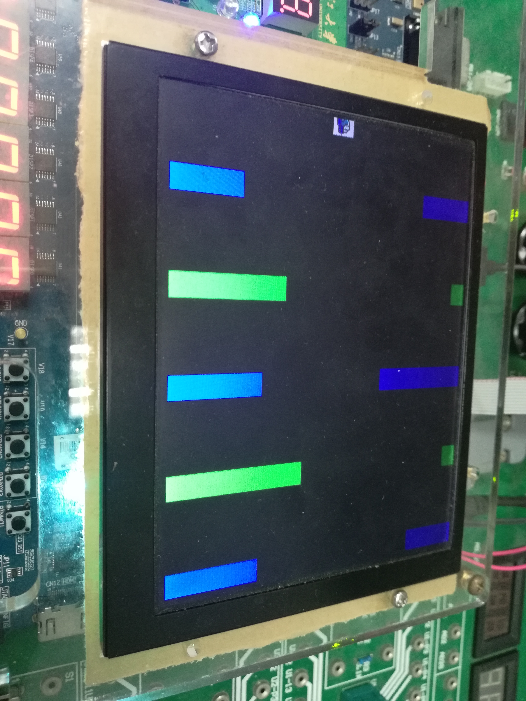

## 计算机组成大程 实验报告

蒋仕彪 3170102587 求是科学班（计算机）1701

### 1. 实验简介

本次计算机组成大程，我选择独立写一个 CPU+VGA+PS2 的小游戏。
主要难点有以下两条：
+ 我们写的CPU，能跑的指令条数很少。
+ MIPS命令全要手写，实现的代码逻辑不能太难。

基于这两个原因，很多同学选择了迷宫、魔塔类的静态游戏（VGA不用高速刷新，每次只要读取改变的色块即可），而我决定做一个更有挑战性的 Flappy Bird。
我从第七周周二下午开始做，周三周四每天都泡在实验室，做到周五上午收工。

### 2. 用户手册

+ 开机运行后，会呈现如下画面：

	

+ 界面和操作
	- 画面会随着时间向左移动，小鸟会受到重力，每秒下降一格。
	- 可以按空格跳跃，按回车加速向下。
	- 汇编指令了做了按键处理，按下一次后必须松开按第二次才继续有效。
	- 越到后来画面会越来越快，难度也越来越大。
	- 拨上 `SW[2]`后，整个游戏会暂停（如果此时拨`SW[7:5]=111` ，可以查看 `PC` 的运行地址）

+ 分数和死亡
	- 拨 `SW[7:5]=100`后，七段数码管会显示分数。每越过一根柱子，分数会加一。（如以下两张图）

	
    
	- 当小鸟撞到上天花板或地板或者柱子时，游戏结束，画面和分数停止。
	- 死亡时如果拨上 `SW[7:5]=111` 查看，会看到PC在两个数之间来回切换，因为 CPU 已经进入死亡循环。如以下这张图（198是死亡后死循环地址）。

	
	
- 按下 RST 键可以重置游戏。
	
+ 调试模式
	- 该模式是我初期写代码时，为了方便调试而加上去的，主要用于实时查看 CPU 里的某个寄存器的值。
	- 拨上 `SW[8]`，进入调试模式。汇编代码里定义好的常量 `a[3]` 记录了一组指定地址，可以把要调试的信息 `sw` 进去，拨上 `SW[2]` 和 `SW[8]` 后，VGA 会读取这一段地址的值，并在 `top.v` 里传给七段数码管（通过`SW[7:5]=101` 来查看）。

### 3. 总体架构

##### 3.1 系统体系结构：

 ~~~mermaid
    graph TD;
    	CPU-->BUS;
        RAM-->BUS;
        BUS-->VGA;
        PS2-->BUS;
        BUS-->CPU;
        BUS-->RAM;
 ~~~

##### 3.2 Flappy Bird 实现的基本原理

+ 强制下落的时间点
	- 我们需要让 VGA 实现一卡一卡的效果，所以在一些关键点才强制下落。
	- 对此解决方案是：在 CPU 里设置一个大循环。每次将循环变量 +1，只有当其达到某个值的时候，才进行向左一帧的描述。
	- **一个很重要的细节问题：在MIPS中，slti 后紧跟的立即数是带符号的。** 比如 `0x4000` 是正常值，而 `0xF0000` 其实是个负数。我本来在卡时间的时候，觉得 `0x4000` 运动得还是快了点，但是改成 `0XF0000` 后，发现一开始就撞到地了……最后的解决方法是，我直接把 `CPU` 的时钟调慢了，这样立即数就可以写得小一点了。

+ 画面向左移动
	- 我们要实现的是：Flappy Bird 在飞行的时候，画面会一帧一帧地向左运动。
	- 其实画面向左的时钟，是和强制下落是相同的。CPU 每次在强制下落的时候，都传递信号给 VGA，这样，每当 VGA 收到信号的时候，就在显示时实行位移操作。
	- 一个改进的小 tips：可以将循环的阈值随时间逐渐减小，这样向左的帧数会越来越快，游戏难度也就越来越大。

+ 柱子的生成
	- 每个柱子其实有五维信息，分别是 R、G、B（表示柱子颜色）、H1（上柱子高度）、H2（下柱子高度）。当然我们可以把这些信息压在一起，总共有 `20 bit`。
	- 本来我想当然地认为，可以每次随机出柱子的信息。可是“随机”这个东西很难在汇编代码里体现。最后，我决定在 `coe` 里 `256-511` 字节的地方存入实现生成好的柱子信息。我在 `CPU` 里开一个寄存器 `s0`，表示当前最左边的柱子的编号（取值为`256 ~ 511`），每强制下落时，`s0++`。

+ **难点：动态图像显示中，CPU和VGA的数据交互**
	- 这是我遇到的最大的问题。在我的架构里，VGA 每次指出一个想要获得数据的地址 `addr[31:0]`，丢给 `BUS`，`BUS` 负责在对应的 `RAM` 里寻找数据并返回 `data[31:0]`。问题是，VGA 里想获得的信息是多元化的：当前每根柱子的信息、当前小鸟的高度、当前到了第几根柱子。**因为和 `BUS` 的连线只有一根，我做不到同时访问三个不同地址的数据。**对此，可能的解决方法有两种：
		1. 每次给 `BUS` 地址的时候，交替地给三种不同的地址。
		2. 将三个数据压在同一个数据里交互。
	- 本来我是选择 1 方案的，但是实现的时候极其不优美。主要原因是，我不知道在多少的时间间隔切换查询地址（而且同一个查询也会随着像素的不同而需求地址不同），会发生严重的时序问题。
	- 那应该如何把这三个数据压在一起呢？柱子颜色和当前高度是不能省的，一共占了 `20 + 4 = 24 \ bit`（高度是 $0 \sim 14$ 取值的，一共有 `4` 位）。但是 `s0` 太长了！后来我想到了一个解决方法：**每次交互时只传一个bit，表示s0是否改变**。这样，我在 VGA 里也开一个计数器，同步地从 `256` 开始，每次收到 `1` 信号时就加一。这样，一根柱子的信息就压到了 `25 bit`。

### 4. MIPS指令和外围接口的详细说明

##### 4.1 变量的意义约定

  + |变量|意义|
    |---|----|
    |$t0$|当前循环次数|
    |$t1$|常数 `0x03E8`（coe数据块起始地址）|
    |$t2 \sim t5$|临时变量|
    |$t6$|上柱子死亡判定常数|
    |$t7$|下柱子死亡判定常数|
    |$s0$|当前最靠左柱子的编号|
    |$s1,s2$|用来读取柱子的柱子地址|
    |$s3$|空格键防抖动|
    |$s4$|回车键防抖动|
    |$s5$|小鸟的高度|
    |$s6$|当前帧数速度|
    |$s7$|某个比较常量|
    |$a0$|键盘地址|
    |$a1$|比较常量|
    |$a2$|小鸟高度增量|
    |$a3$|debug地址|

##### 4.2 变量的初始化

   + ~~~Cpp
        //11-0 R,G,B
        //19-16,15-12 <,>
        //23-20 Y
        //24    move
        main:
            add $t0, $zero, $zero; 	   //t0 当前循环次数
            addi $s0, $zero, 0x0100;	  //s0 当前在哪一根柱子
                                          //s1 用来读取柱子；s2 = s0 * 4
            add $s3, $zero, $zero;		//s3 上一次是否敲击空格键
            add $s4, $zero, $zero;		//s4 上一次是否敲击回车键
            addi $s5, $zero, 0x0007;	  //s5  Y坐标
            addi $s6, $zero, 0x3000;      //s6  speed
            addi $s7, $zero, 0x0006;	  //s7  某个比较常量

            addi $t1, $zero, 0x03E8;
            lw $a0, 0($t1);			//0xD0000000	键盘地址
            lw $a1, 4($t1);			//0xFF0FFFFF 比较常量
            lw $a2, 8($t1);			//0x01000000	切换状态（越过当前这个柱子）
            lw $a3, 12($t1);		   //0x000007FC	debug地址
            lw $t6, 16($t1);		   //0x000F0000	读取上柱子高度
            lw $t7, 20($t1);		   //0x0000F000	读取下柱子高度
        ~~~

    ~~~

##### 4.3 主循环

+ 如上提到，有一个控制强制下落的大循环。
+ 为了保证小鸟高度的稳定性，每次在循环开头，我都会保存一遍小鸟的位置
	- 如下所述，数据 `25 bit`，足够存的下，我只需覆盖以前的柱子信息即可。
	- 具体做法是：
		1. 读入当前柱子信息
		2. 去除其对应的小鸟高度信息
		3. 覆盖成现在的高度信息
		4. 写入柱子信息
	- 注意，**我们自己实现的CPU不带左移功能**，于是我用加法来实现左移。如下：
	 ~~~Cpp
        Always:
            add $s2, $s0, $s0
            add $s2, $s2, $s2
            lw  $s1, 0($s2);
            and $s1, $s1, $a1;

            add $t1, $s5, $s5;
            add $t1, $t1, $t1;
            add $t1, $t1, $t1;
            add $t1, $t1, $t1;
            add $t1, $t1, $t1;
            add $t1, $t1, $t1;
            add $t1, $t1, $t1;
            add $t1, $t1, $t1;
            add $t1, $t1, $t1;
            add $t1, $t1, $t1;
            add $t1, $t1, $t1;
            add $t1, $t1, $t1;
            add $t1, $t1, $t1;
            add $t1, $t1, $t1;
            add $t1, $t1, $t1;
            add $t1, $t1, $t1;
            add $t1, $t1, $t1;
            add $t1, $t1, $t1;
            add $t1, $t1, $t1;
            add $t1, $t1, $t1;

            or $s1, $s1, $t1;
            sw $s1, 0($s2);
	 ~~~

##### 4.4 死亡逻辑判断

+ 这一模块看似简单，MIPS写起来还是挺头疼的。
+ 注意，**什么时候要进行死亡逻辑判断？**
	- 在此处只要对撞柱子判定。因为天花板和地面会在当时加/减的时候判定。
	- 首先我要判断一下当前图模 4 的状态。因为小鸟只会在与最左边柱子同一列时发生碰撞。
	- 然后我们要分别判定，小鸟的高度是否和上柱子撞在一起，或者是否和下柱子撞在一起。
	- 必须两边都没撞到才能跳出死亡判定，否则进入死亡循环。
	 ~~~Cpp
        Check:
            addi $t3, $zero, 0x0003;
            and $t5, $s0, $t3;
            xor $t5, $t5, $t3;
            //本来期望 100-3, 101-2, 102-1, 103-0
            //实测 100-3, 101-4, 102-5, 103-6

            lw  $s1, 0($s2);
            and $t2, $s1, $t7;

            add $t1, $s5, $s5;
            add $t1, $t1, $t1;
            add $t1, $t1, $t1;
            add $t1, $t1, $t1;
            add $t1, $t1, $t1;
            add $t1, $t1, $t1;
            add $t1, $t1, $t1;
            add $t1, $t1, $t1;
            add $t1, $t1, $t1;
            add $t1, $t1, $t1;
            add $t1, $t1, $t1;
            add $t1, $t1, $t1;

            slt $t3, $t1, $t2;
            add $t1, $t1, $t1;
            add $t1, $t1, $t1;
            add $t1, $t1, $t1;
            add $t1, $t1, $t1;

            and $t2, $s1, $t6;
            slt $t4, $t2, $t1;
            and $t3, $t3, $t4;
            bne $t5, $s7, Tryup;
            //这句话本来应该在上面，为了速度一致放在这里
            beq $t3, $zero, Gameover;
   ~~~

##### 4.5 键盘操作读取

+ 键盘上会读取跳跃或者下降的命令。
+ 注意，直接这样读取是会有问题的，因为用户可能按了很久。我最开始写完的时候，每次一按空格，小鸟直接飞到顶撞死了 `>_<`。而且这个阈值也挺难调。
+ 对此，我对每一种按键增加了一个防抖动变量 $t$。如果某个时刻没有按到这个按键，那么 $t=0$。每次收到这个按键信息时，必须同时满足 $t=0$ 我才认可（相当于是 posedge 的概念），随后 $t$ 也会别置为 $1$。
	- 整个键盘读取操作如下：
	~~~Cpp
        Tryup:
            lw $s1, 0($a0); 
            addi $t1, $zero, 0x0029;		//space
            beq $s1, $t1, Up;
            add $s3, $zero, $zero;
            bne $s1, $t1, Trydown;
        Up:
            bne $s3, $zero, Trydown;
            addi $s3, $s3, 1;
            beq $s5, $zero, Gameover;
            addi $s5, $s5, -1;

        Trydown:
            lw $s1, 0($a0);
            addi $t1, $zero, 0x005A;		//enter
            beq $s1, $t1, Down;
            add $s4, $zero, $zero;
            bne $s1, $t1, Mustdown;
        Down:
            bne $s4, $zero, Mustdown;
            addi $s4, $s4, 1;
            slti $t1, $s5, 14;
            beq $t1, $zero, Gameover;
            addi $s5, $s5, 1;
  ~~~

##### 4.6 强制下降和死循环

+ 判定完按键后，有大概率会直接 `continue` 进行下一个循环。
+ 只有当目前大循环次数达到一定阈值（进行强制下落）时，会进行接下来的一系列操作：
	1. 将次数重新置为 0.
	2. 将循环阈值减少（帧数加快）
	3. 最左边柱子可能会修改
	4. 改变小鸟高度
	5. 判断改变后小鸟是否撞到地。
	- 代码如下：
	~~~Cpp
        Mustdown:
            addi $t0, $t0, 1;
            slt $t1, $t0, $s6;
            bne $t1, $zero, Always;
            add $t0, $zero, $zero;
            addi $s6, $s6, -0x0030;		//speed up
            lw $s1, 0($s2);
            xor $s1, $s1, $a2;
            sw $s1, 0($s2);
            addi $s0, $s0, 1;
            slti $t1, $s0, 0x0200;
            bne $t1, $zero, NotMod;
            addi $s0, $zero, 0x0100;
        NotMod:
            slti $t1, $s5, 14;
            beq $t1, $zero, Gameover;
            addi $s5, $s5, 1;
            j Always;
        Gameover:
        Deadloop:
            j Deadloop;
            j Deadloop;
  ~~~

##### 4.8 bus接口的增加

+ 因为改成了双端口的 `RAM`，而且连了 VGA 和 PS2，要在 bus 改变一些线的位宽，同时加入下列的代码：
	~~~verilog
    	case(addr_bus[31:28])
			4'h0:begin
				 data_ram_we = mem_w;
				 ram_addr = addr_bus[10:2];
				 ram_data_in = Cpu_data2bus;
				 data_ram_rd = ~mem_w;
			end
			4'hd:begin // keyborad
				ps2kb_rd = ~mem_w;
			end
        casex({data_ram_rd,GPIOe0000000_rd,counter_rd,GPIOf0000000_rd,ps2kb_rd})
			5'b1xxxx:Cpu_data4bus = ram_data_out;
			5'bx1xxx:Cpu_data4bus = counter_out;
			5'bxx1xx:Cpu_data4bus = counter_out;
			5'bxxx1x:Cpu_data4bus = {counter0_out,counter1_out,counter2_out,17'b0,BTN[3:0],SW[7:0]};
			5'bxxxx1:Cpu_data4bus = {22'd0, ps2kb_key};
			default :Cpu_data4bus = 32'h0;
		endcase
  ~~~

##### 4.7 外围 VGA 的实现代码

+ VGA 不仅要定期扫描，还要正确地给出 `addr`，以收到正确的 `color` 数据信息。

	~~~verilog
        initial begin
            cnt_x = 10'd0;
            cnt_y = 10'd0;
            pos   =  9'd256;
            run   =  2'd3;
            cur   =  4'd7;
            score = 32'd0;
        end
        always @(posedge clk) begin
            if (rst) cnt_x <= 10'd0;
            else if (cnt_x == 10'd799) cnt_x <= 10'd0;
            else cnt_x <= cnt_x + 10'd1;
        end
        always @(posedge clk) begin
            if (rst) cnt_y <= 10'd0;
            else if(cnt_x == 10'd799) begin
                if (cnt_y == 10'd524) cnt_y <= 10'd0;
                else cnt_y <= cnt_y + 10'd1;
            end
        end
        always @(posedge clk) begin
            if (rst) begin
                pos   =  9'd256;
                run   =  2'd3;
                cur   =  4'd7;
                score = 32'd0;
            end
            else if (color[11:0] && addrb == pos) begin
                cur = color[23:20];
                if (run == 2'd3) run = {1'b0, color[24]};
                else if (run[0] ^ color[24])
                    begin
                        run = 2'd3;
                        score = score + 32'd1;
                        if (pos == 9'd511) pos = 9'd0;
                        else pos = pos + 9'd1;
                    end
            end
        end
        assign x_ptr = cnt_x - (96+40+8);
        assign y_ptr = cnt_y - (2+25+8);
        assign hs = !((cnt_x >= 0) && (cnt_x < 96));
        assign vs = !((cnt_y >= 0) && (cnt_y < 2));
        assign valid = x_ptr && x_ptr < 640 && y_ptr >= 0 && y_ptr < 480;
        assign mod = pos[1:0] ^ (2'd3);
        assign in   = valid && x_ptr[6:5] == mod && (y_ptr[8:5] <= color[19:16] || y_ptr[8:5] >= color[15:12]);
        assign bird = valid && x_ptr[9:5] == 5'd0 && y_ptr[8:5] == cur;
        assign addrb = SW ? 11'd511 : (bird ? (11'd512 + {1'd0, y_ptr[4:0], 5'd0} + {6'd0, x_ptr[4:0]}) :((valid && x_ptr[6:5] == mod) ? 11'd256 + (({2'd0, pos} - 11'd256 + {6'd0, x_ptr[9:7], 2'd0}) & 11'd255) : 11'd255));
        assign red =   bird || in ? color[11:8] : 1'h0;
        assign green = bird || in ? color[7:4] : 1'h0;
        assign blue =  bird || in ? color[3:0] : 1'h0;
  ~~~

### 5. 实验心得

这次大作业我提前就做起来了，整整历时五天。
我中途遇到了各种奇怪的问题，比如：

+ VGA 始终无法显示图像（遇到了一些时序的问题）
+ 无法正常的进行J指令跳转（这个问题后来也时有发生，有时换个写法就能过）
+ 由于没有一些指令（shl、shr等），自然达不到想要的效果
+ ……

对于这些问题我没有气馁，还专门写了一个调试端口，直接在数码管中打出寄存器的值。
这次大程真是蛮有收获，对MIPS指令也有了更深的理解，各种接口也更熟悉了。
感谢马老师的高要求，也感谢自己能一直这么坚持不懈不忘初心！